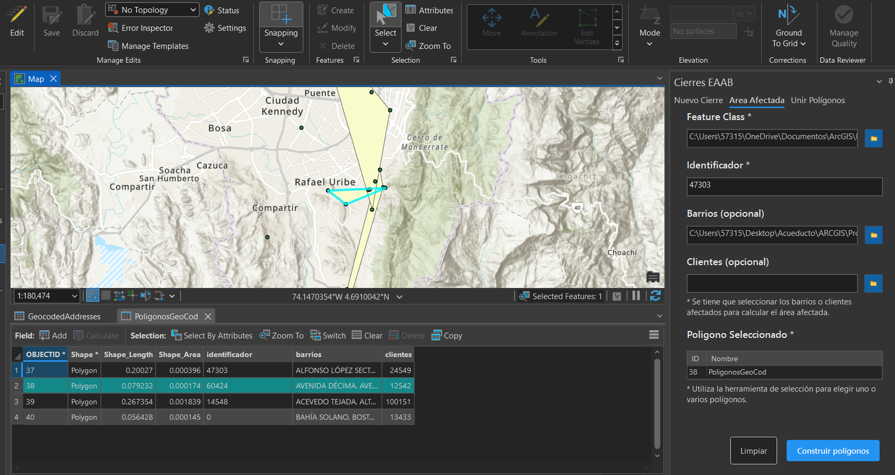

# MANUAL DEL USUARIO PARA EL USO DEL ADD-IN EAAB

| Fecha   | 21/10/2025 |
| ------- | ---------- |
| Version | 2.0.1      |

## Tabla de Contenido

1. [Introducción](#introducción)
2. [Objetivo](#objetivo)
3. [Capacidades](#capacidades)
4. [Instalación](#instalación)
5. [Uso](#uso)
   1. [Funciones de geocodificación](#funciones-de-geocodificacion)
      1. [Buscar una Dirección Individual](#1-buscar-una-dirección-individual)
      2. [Geocodificar Direcciones Masivamente](#2-geocodificar-direcciones-masivamente)
      3. [Búsqueda de Puntos de Interés (POIs)](#3-búsqueda-de-puntos-de-interés-pois)
      4. [Cambiar la Configuración de Conexión](#4-cambiar-la-configuración-de-conexión)
   2. [Funciones de cierres](#funciones-de-cierres)
      1. [Crear Nuevo Cierre](#1-crear-nuevo-cierre)
      2. [Calcular Área Afectada](#2-calcular-área-afectada)
      3. [Unir Polígonos](#3-unir-polígonos)
6. [Problemas](#problemas)
   1. [Fallo en la conexión con la base de datos](#1-fallo-en-la-conexión-con-la-base-de-datos)
   2. [Error "Edición no habilitada" al unir polígonos](#2-error-edición-no-habilitada-al-unir-polígonos)

## Introducción

Este manual ha sido creado para guiar al usuario en la instalación, configuración y uso del Add-In EAAB para ArcGIS Pro, desarrollado por la Dirección de Información Técnica y Geográfica de la Empresa de Acueducto y Alcantarillado de Bogotá - E.S.P. (EAAB E.S.P.).

El objetivo de esta guía es describir de forma clara y práctica las funcionalidades incluidas hasta la versión 2.0 y los pasos necesarios para integrarlas en los flujos de trabajo GIS de la organización. El Add-In facilita principalmente dos procesos clave: la geocodificación de direcciones (transformar direcciones en coordenadas geográficas) y la creación de cierres (generación y validación de polígonos de cierre para parcelas, redes u otras geometrías). Estas funciones están orientadas a automatizar tareas repetitivas, mejorar la calidad de los datos espaciales y reducir el tiempo requerido por los analistas.

Este documento está organizado en secciones que cubren: objetivos y capacidades del Add-In; requisitos e instalación; instrucciones paso a paso para el uso de las herramientas; ejemplos prácticos; y solución de problemas y preguntas frecuentes. Antes de usar el Add-In, se recomienda revisar la sección de requisitos para confirmar la versión compatible de ArcGIS Pro y los permisos necesarios. Para mayor claridad, cada procedimiento incluye capturas de pantalla, ejemplos de entrada/salida y notas sobre limitaciones conocidas.

## Objetivo

Proporcionar una herramienta de apoyo dentro de ArcGIS Pro que facilite a los trabajadores de la Dirección de Información Técnica y Geográfica la realización de procesos de geocodificación y generación de cierres espaciales. Para ello, permite automatizar la localización de direcciones, la creación de polígonos de áreas afectadas y la gestión estructurada de los resultados en las bases de datos corporativas, con el fin de optimizar el tiempo de análisis, mejorar la precisión de la información geográfica y estandarizar los procedimientos operativos dentro de la entidad.

## Capacidades

### Funciones de geocodificacion

El Add-In permite transformar direcciones en ubicaciones espaciales precisas dentro de ArcGIS Pro, mediante un proceso de geocodificación que puede realizarse de forma individual o masiva. Para ello, la herramienta integra un buscador que prioriza las fuentes de información de la EAAB y, en caso de no encontrar coincidencias, utiliza fuentes externas como Catastro o ESRI. Los resultados incluyen coordenadas geográficas y metadatos asociados.

### Funciones de cierres

El Add-In facilita la creación y gestión de polígonos de cierre que representan áreas afectadas o zonas de interés dentro del territorio. A través de herramientas integradas en la interfaz, los usuarios pueden generar polígonos a partir de puntos o capas existentes, utilizando métodos como envolventes convexas o cóncavas.

## Instalación

Para instalar el Add-In, el usuario debe ejecutar el archivo correspondiente y, en la ventana del asistente de instalación de ESRI ArcGIS Add-In Installation Utility, hacer clic en el botón “Install Add-In”. Una vez completado el proceso, la herramienta quedará disponible dentro de ArcGIS Pro en la pestaña asignada por la EAAB.

## Uso

Una vez completada la instalación, el Add-In agrega una nueva pestaña llamada “EAAB Add-In” en la parte superior de ArcGIS Pro. Desde esta pestaña, el usuario puede acceder a todas las funciones disponibles, organizadas en botones y paneles de fácil acceso.

### Funciones de geocodificacion

#### 1. Buscar una Dirección Individual

Esta función permite localizar una dirección específica y visualizarla directamente en el mapa de ArcGIS Pro.

##### Pasos

1. Haga clic en el botón **“Buscar”** dentro de la pestaña *EAAB Add-In*.

2. Se abrirá un panel lateral a la derecha de la pantalla.

3. Seleccione la ciudad correspondiente desde la lista desplegable.

4. Ingrese la dirección completa que desea buscar (por ejemplo: *“Calle 123 #45-67”*).

5. Presione el botón **“Buscar Dirección”** para iniciar el proceso.

##### Resultados

El Add-In procesará la información ingresada, realizará la búsqueda priorizando las fuentes de datos de la EAAB y, en caso necesario, recurrirá a Catastro o ESRI. Si la dirección es encontrada, el mapa se desplazará automáticamente hacia la ubicación correspondiente, generando un punto de referencia en la capa `GeocodedAddresses`. Esta capa almacenará información relevante como la dirección ingresada, la dirección encontrada, la fuente de origen, la puntuación de coincidencia (score), así como la fecha y hora de la búsqueda.

En caso de no hallarse la dirección, el sistema la registrará automáticamente en una tabla de direcciones no encontradas `GeocodeNotFound`, con el fin de permitir su revisión y análisis posterior por parte del equipo técnico.

##### Consejos

- Si la lista de ciudades aparece vacía, utilice el botón **“Recargar”** (ícono de actualización) para refrescar los datos.

- Verifique en el panel de estado que la conexión a la base de datos esté activa antes de realizar una búsqueda.

- Durante el proceso, podrá observar una barra de progreso que indica el avance de la operación.

- Para mejorar los resultados, se recomienda ingresar direcciones completas y estandarizadas, siguiendo el formato habitual de la EAAB.

#### 2. Geocodificar Direcciones Masivamente

Esta función permite procesar simultáneamente un gran número de direcciones a partir de un archivo de Excel, lo que agiliza considerablemente el trabajo de geocodificación cuando se manejan bases de datos extensas.

##### Preparar el archivo Excel

Antes de iniciar el proceso, es necesario contar con un archivo de Excel correctamente estructurado. El archivo debe contener exactamente tres columnas con los siguientes nombres:

| Identificador | Direccion    | Poblacion |
| ------------- | ------------ | --------- |
| 001           | CL 123 45 67 | 11001     |
| 002           | KR 50 20 30  | 11001     |

- Identificador: Código único.

- Direccion: Dirección completa que se desea localizar.

- Poblacion: Codigo de la ciudad.

**Pasos:**

1. Haz clic en el botón **"Masivo"** en la pestaña EAAB Add-in
2. Se abrirá un panel a la derecha
3. Haz clic en **"Examinar..."** y selecciona tu archivo Excel (.xlsx)
4. El sistema revisará que tu archivo tenga el formato correcto
5. Si todo está bien, haz clic en **"Procesar Archivo"**
6. Espera mientras se procesan las direcciones (verás una barra de progreso)

**Resultados:**

Al finalizar la ejecución, el sistema mostrará un resumen con el número total de direcciones procesadas, cantidad de coincidencias encontradas y direcciones no localizadas. Las direcciones correctamente geocodificadas se agregarán automáticamente a la capa `GeocodedAddresses`, mientras que las no encontradas se registrarán en la tabla `GeocodeNotFound` con su identificador, dirección, ciudad y la fecha y hora del intento.

#### 3. Búsqueda de Puntos de Interés (POIs)

El Add-In incluye una función que permite buscar y ubicar **Puntos de Interés (POIs)** dentro del territorio de operación de la EAAB. En este contexto, un POI puede corresponder a **barrios, localidades, sectores o zonas de referencia**, los cuales son útiles para la identificación espacial de áreas donde se desarrollan actividades operativas, análisis o proyectos técnicos.

##### Pasos

1. Haga clic en el botón **“POI”** en la pestaña *EAAB Add-In* (ícono de lupa sobre un edificio).

2. Se abrirá un panel lateral similar al utilizado en la búsqueda de direcciones.

3. Ingrese un término de búsqueda que corresponda al nombre del barrio, localidad o sector de interés (por ejemplo: *“Fontibón”*, *“Chapinero”*, *“Suba”*, *“Acueducto”*).

4. (Opcional) Puede restringir la búsqueda seleccionando una ciudad o limitándola al área visible del mapa.

5. Dependiendo del caso:
   1. Seleccione un resultado específico de la lista y haga clic en **“Ubicar seleccionado”** para centrar el mapa en esa ubicación.
   2. O bien, presione **“Ubicar todos”** para agregar y centrar todos los resultados encontrados.

6. Si modifica el texto de búsqueda, use **“Buscar POI”** para actualizar la lista de coincidencias.

##### Resultados

El sistema mostrará los lugares que coincidan con el término ingresado, incluyendo su **nombre**, **tipo** y **código** de identificación. Al seleccionar un POI, el mapa se desplazará automáticamente hacia la ubicación correspondiente y se agregará un marcador en la capa `GeocodedAddresses`. Si el usuario elige la opción **“Ubicar todos”**, se insertarán todos los puntos visibles en el mapa, lo que facilita una vista general del área de interés.  

#### 4. Cambiar la Configuración de Conexión

El Add-In permite modificar fácilmente la conexión a la base de datos en caso de que el usuario necesite actualizar sus credenciales o trabajar con un entorno diferente (por ejemplo, cambiar entre bases de datos de prueba y producción).

1. Diríjase al menú **Archivo → Opciones → EAAB Add-In** dentro de ArcGIS Pro.

2. En la ventana que se abrirá, edite los campos correspondientes según la nueva configuración requerida (usuario, contraseña, servidor o tipo de base de datos).

3. Haga clic en **“Probar Conexión”** para verificar que los datos ingresados sean correctos y que el sistema pueda establecer comunicación con la base de datos seleccionada.

4. Si la prueba es exitosa, presione **“Guardar y Conectar”** para aplicar los cambios.

Los datos modificados se guardan automáticamente mientras se editan, garantizando que la configuración actualizada quede registrada de forma inmediata.

### Funciones de cierres

#### 1. Crear Nuevo Cierre

Esta herramienta permite **generar automáticamente polígonos de cierre** a partir de una capa de puntos, agrupándolos según un identificador común. Es ideal para delimitar áreas de intervención o de afectación a partir de elementos como válvulas, medidores o puntos operativos.

##### Pasos de uso

1. Haz clic en el botón **“Nuevo Cierre”** dentro de la pestaña **EAAB Add-In**.

2. Se abrirá un panel lateral con las siguientes opciones de configuración

##### Configuración básica

- **Workspace:** Selecciona la geodatabase donde se guardarán los polígonos generados.

- **Feature Class de Puntos:** Capa de puntos desde la cual se generarán los cierres.

- **Campo Identificador:** Campo que agrupa los puntos en conjuntos (por ejemplo, `ID_ORDEN` o `CODIGO_CIERRE`).

- **Feature Class de Barrios:** *(Opcional)* Capa de polígonos de barrios. El sistema identificará qué barrios intersecta cada cierre.

- **Feature Class de Clientes:** *(Opcional)* Capa de puntos de clientes para calcular cuántos se encuentran dentro del área afectada.

##### Resultados

- Se generarán **polígonos envolventes (convex hull)** por cada grupo de puntos con el mismo valor en el campo identificador.

- Los polígonos se almacenarán en una **nueva Feature Class** dentro del workspace seleccionado.

- Si se configuraron barrios o clientes, el resultado incluirá:
  
  - **BARRIOS:** Lista de barrios intersectados (separados por comas).
  
  - **CLIENTES:** Número total de clientes afectados dentro del cierre.

- Al finalizar, se mostrará un resumen con el número total de cierres generados.

##### Requisitos

- Cada grupo debe contener **al menos 3 o 4 puntos** para formar un polígono válido.

- Los puntos deben compartir el mismo valor en el **campo identificador** para agruparse correctamente.

- Desde los ajustes del Add-In, se puede configurar si se permiten **triángulos (3 puntos)** como cierres válidos.

#### 2. Calcular Área Afectada

Esta función permite actualizar polígonos existentes con información de barrios y clientes afectados, sin necesidad de regenerar los polígonos.

##### ¿Cuándo usar esta función?

- Ya tienes polígonos de cierre creados manualmente o por otro método
- Necesitas actualizar la información de barrios y clientes en polígonos existentes
- Quieres enriquecer polígonos con datos de intersección espacial

##### Pasos

1. **Selecciona los polígonos** en el mapa que deseas actualizar
2. Haz clic en el botón **"Área Afectada"** en la pestaña EAAB Add-in
3. En el panel que se abre, configura:

##### Configuración requerida

- **Workspace**: Geodatabase de trabajo
- **Feature Class de Polígonos**: La capa que contiene los polígonos seleccionados
- **Campo Identificador**: Campo que identifica cada polígono (para actualización)

##### Configuración opcional

- **Feature Class de Barrios**: Capa de barrios (obligatoria)
- **Feature Class de Clientes**: Capa de clientes (obligatoria)
- Haz clic en **"Calcular"**

##### Resultados

- Los polígonos seleccionados se actualizarán con:
  - **BARRIOS**: Nombre de los barrios que intersectan con el polígono
  - **CLIENTES**: Cantidad de puntos de clientes dentro del polígono
- El panel mostrará cuántos polígonos se procesaron exitosamente
- Los cambios se guardan directamente en la Feature Class

##### Contador de selección

El panel muestra en tiempo real cuántos polígonos tienes seleccionados, ayudándote a verificar antes de ejecutar el cálculo.

#### 3. Unir Polígonos

Esta herramienta permite fusionar múltiples polígonos seleccionados en uno solo, combinando sus atributos de forma inteligente.

##### ¿Cuándo usar esta función?

- Necesitas consolidar varios cierres en un área de impacto única
- Quieres fusionar zonas adyacentes o superpuestas
- Requieres combinar atributos de múltiples polígonos (sumar clientes, unir barrios)

##### Pasos

1. **Selecciona 2 o más polígonos** en el mapa que deseas unir
2. Haz clic en el botón **"Unir Polígonos"** en la pestaña EAAB Add-in
3. En el panel que se abre, configura:

##### Configuración requerida

- **Workspace**: Geodatabase donde se guardará el polígono unido
- **Feature Class de Origen**: La capa de donde provienen los polígonos seleccionados
- **Campo Identificador**: Campo que identificará al nuevo polígono unido
- **Valor del Identificador**: Texto o número para identificar el polígono resultante

##### Configuración opcional

- **Feature Class de Barrios**: Para calcular barrios del polígono unido
- **Feature Class de Clientes**: Para contar clientes en el polígono unido

##### Resultados

- Se genera un **nuevo polígono** que representa la unión geométrica de todos los seleccionados
- Los atributos se combinan inteligentemente:
  - **Campos numéricos**: Se suman (ej: total de clientes)
  - **Campo identificador**: Usa el valor que especificaste
  - **BARRIOS**: Combina y lista todos los barrios únicos
  - **CLIENTES**: Suma total de clientes o recalcula según geometría
- El nuevo polígono se agrega automáticamente al mapa
- Los polígonos originales **no se eliminan**, permanecen intactos
- El mapa hace zoom automático al polígono generado

##### Gestión de conflictos

Si la Feature Class de salida no tiene permisos de escritura o ya existe el registro, el sistema intentará automáticamente:

- Usar la geodatabase por defecto del proyecto
- Generar un nombre único agregando sufijo numérico
- Informarte de la ubicación alternativa donde se guardó

## Problemas

A continuación, se describen algunos de los inconvenientes más comunes que pueden presentarse durante el uso del Add-In, junto con las acciones recomendadas para resolverlos de manera segura y eficiente.

### 1. Fallo en la conexión con la base de datos

#### Descripción

En algunos casos, el Add-In puede mostrar mensajes de error relacionados con la conexión a la base de datos corporativa. Esto puede deberse a credenciales incorrectas, pérdida de conexión temporal con el servidor o configuraciones incompletas.

#### Solución

Verifique que los datos de conexión (usuario, contraseña, servidor y tipo de base de datos) sean correctos. Para hacerlo, acceda a Archivo → Opciones → EAAB Add-In, actualice la información y utilice el botón “Probar Conexión”. Si el error persiste, cierre y reinicie ArcGIS Pro para restablecer la sesión de conexión. En caso de continuar el problema, contacte al área técnica encargada de las bases de datos para verificar el estado del servidor o las credenciales asignadas.

### 2. Error “Edición no habilitada” al unir polígonos

#### Descripción

Durante la ejecución de operaciones espaciales, especialmente al unir polígonos o generar cierres, puede aparecer el mensaje “Edición no habilitada”. Este error suele presentarse cuando el entorno de edición de ArcGIS Pro se encuentra bloqueado o presenta inconsistencias temporales en el caché.

#### Solución

Cierre todos los proyectos abiertos y elimine el caché de ArcGIS Pro. Si el problema persiste, se recomienda realizar una instalación limpia de ArcGIS Pro, eliminando archivos residuales antes de la reinstalación para asegurar un entorno estable.
