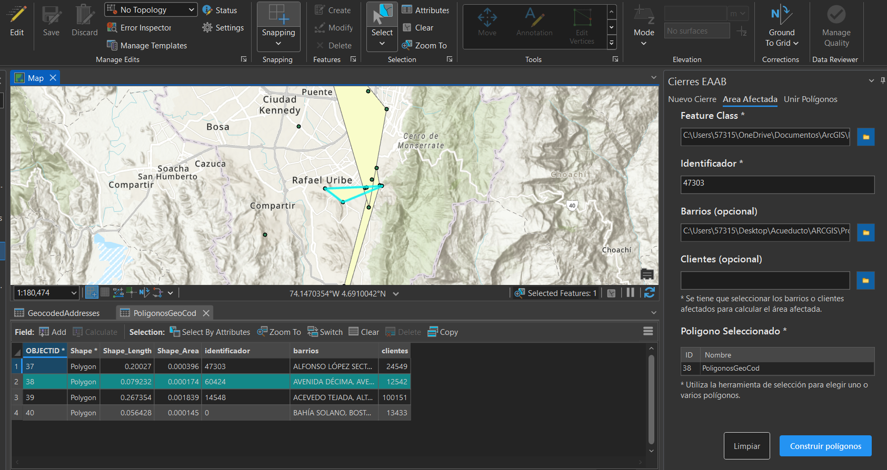

# MANUAL DEL USUARIO PARA EL USO DEL ADD-IN EAAB

| Fecha   | 05/03/2026 |
| ------- | ---------- |
| Version | 3.0.0      |

## Tabla de Contenido

1. [Introducción](#introducción)
2. [Objetivo](#objetivo)
3. [Requisitos del Sistema](#requisitos-del-sistema)
4. [Capacidades](#capacidades)
5. [Instalación](#instalación)
6. [Uso](#uso)
   1. [Funciones de geocodificación](#funciones-de-geocodificacion)
      1. [Buscar una Dirección Individual](#1-buscar-una-dirección-individual)
      2. [Geocodificar Direcciones Masivamente](#2-geocodificar-direcciones-masivamente)
      3. [Búsqueda de Puntos de Interés (POIs)](#3-búsqueda-de-puntos-de-interés-pois)
      4. [Cambiar la Configuración de Conexión](#4-cambiar-la-configuración-de-conexión)
   2. [Funciones de cierres](#funciones-de-cierres)
      1. [Crear Nuevo Cierre](#1-crear-nuevo-cierre)
      2. [Calcular Área Afectada](#2-calcular-área-afectada)
      3. [Unir Polígonos](#3-unir-polígonos)
   3. [Migración de Datos](#migración-de-datos)
   4. [Cortar Feature Dataset (Clip)](#cortar-feature-dataset-clip)
   5. [Generador de Hash SHA256](#generador-de-hash-sha256)
7. [Problemas](#problemas)
   1. [Fallo en la conexión con la base de datos](#1-fallo-en-la-conexión-con-la-base-de-datos)
   2. [Error "Edición no habilitada" al unir polígonos](#2-error-edición-no-habilitada-al-unir-polígonos)

## Introducción

Este manual ha sido creado para guiar al usuario en la instalación, configuración y uso del Add-In EAAB para ArcGIS Pro, desarrollado por la Dirección de Información Técnica y Geográfica de la Empresa de Acueducto y Alcantarillado de Bogotá - E.S.P. (EAAB E.S.P.).

El objetivo de esta guía es describir de forma clara y práctica las funcionalidades incluidas hasta la versión 3.0 y los pasos necesarios para integrarlas en los flujos de trabajo GIS de la organización. El Add-In facilita cinco procesos clave: la geocodificación de direcciones (transformar direcciones en coordenadas geográficas), la creación de cierres (generación y validación de polígonos de cierre), la migración de datos de redes de acueducto y alcantarillado a la estructura corporativa, el corte espacial de conjuntos de datos por área de interés y la verificación de integridad de archivos mediante hashes SHA256. Estas funciones están orientadas a automatizar tareas repetitivas, mejorar la calidad de los datos espaciales y reducir el tiempo requerido por los analistas.

Este documento está organizado en secciones que cubren: requisitos del sistema; instalación y configuración inicial; objetivos y capacidades del Add-In; instrucciones paso a paso para el uso de las herramientas; y solución de problemas frecuentes. Antes de usar el Add-In, se recomienda revisar la sección de requisitos para confirmar la versión compatible de ArcGIS Pro y los permisos necesarios. Para mayor claridad, cada procedimiento incluye capturas de pantalla, ejemplos de entrada/salida y notas sobre limitaciones conocidas.

## Objetivo

Proporcionar una herramienta de apoyo dentro de ArcGIS Pro que facilite a los trabajadores de la Dirección de Información Técnica y Geográfica la realización de procesos de geocodificación, generación de cierres espaciales, migración de datos de redes, corte de información geográfica y verificación de integridad de archivos. Para ello, el Add-In permite automatizar la localización de direcciones, la creación de polígonos de áreas afectadas, la transformación de datos hacia la estructura corporativa, la extracción de subconjuntos geográficos y la gestión estructurada de los resultados en las bases de datos corporativas, con el fin de optimizar el tiempo de análisis, mejorar la precisión de la información geográfica y estandarizar los procedimientos operativos dentro de la entidad.

## Requisitos del Sistema

Antes de proceder con la instalación, es indispensable verificar que el equipo cumpla con los siguientes requisitos mínimos:

- **ArcGIS Pro 3.4 o superior** instalado y funcionando correctamente.
- **Conexión a la base de datos corporativa** de la EAAB (PostgreSQL u Oracle), con acceso activo a la red institucional.
- **Credenciales de acceso** a la base de datos (usuario y contraseña) proporcionadas por el área de sistemas.

## Capacidades

### Funciones de geocodificacion

El Add-In permite transformar direcciones en ubicaciones espaciales precisas dentro de ArcGIS Pro, mediante un proceso de geocodificación que puede realizarse de forma individual o masiva. Para ello, la herramienta integra un buscador que prioriza las fuentes de información de la EAAB y, en caso de no encontrar coincidencias, utiliza fuentes externas como Catastro o ESRI. Los resultados incluyen coordenadas geográficas y metadatos asociados.

### Funciones de cierres

El Add-In facilita la creación y gestión de polígonos de cierre que representan áreas afectadas o zonas de interés dentro del territorio. A través de herramientas integradas en la interfaz, los usuarios pueden generar polígonos a partir de puntos o capas existentes, utilizando métodos como envolventes convexas o cóncavas.

### Migración de Datos

El Add-In incorpora una herramienta de migración que permite transformar y consolidar datos de redes de acueducto y alcantarillado desde formatos externos o versiones anteriores del modelo de datos hacia la estructura corporativa estándar de la EAAB. Durante el proceso, el sistema valida automáticamente la estructura de los datos, clasifica cada elemento según su tipo y sistema, y genera una geodatabase de destino organizada por categorías de red.

### Cortar Feature Dataset (Clip)

La herramienta de corte permite extraer subconjuntos de datos a partir de un polígono seleccionado como máscara de recorte, lo que resulta útil para delimitar la información geográfica a un área de interés específica. De este modo, es posible generar entregas de datos acotadas por localidad, sector o cualquier otra unidad territorial operativa.

### Verificación de Integridad (Hash SHA256)

El Add-In incluye un módulo para generar y verificar hashes SHA256 de archivos y geodatabases, con el propósito de garantizar su integridad durante el almacenamiento y la transferencia. Esta funcionalidad permite auditar cambios en archivos críticos, validar copias de seguridad y confirmar que los datos recibidos no han sido alterados ni corrompidos.

## Instalación

Para instalar el Add-In, el usuario debe ejecutar el archivo correspondiente y, en la ventana del asistente de instalación de ESRI ArcGIS Add-In Installation Utility, hacer clic en el botón “Install Add-In”. Una vez completado el proceso, la herramienta quedará disponible dentro de ArcGIS Pro en la pestaña asignada por la EAAB.

### Configuración Inicial de la Conexión

La primera vez que se utilice el Add-In, es necesario configurar la conexión a la base de datos corporativa. Para ello, siga los pasos a continuación:

1. Abra **ArcGIS Pro** y diríjase al menú **Archivo → Opciones**.
2. En el panel izquierdo, localice y seleccione la opción **"EAAB Add-In"**.
3. Complete los campos de conexión según el tipo de motor de base de datos disponible:

#### Si utiliza PostgreSQL

- **Motor**: Seleccione "PostgreSQL".
- **Host**: Dirección del servidor (por ejemplo: `192.168.1.100`).
- **Puerto**: Normalmente `5432` (se completa automáticamente).
- **Base de datos**: Nombre de la base de datos.
- **Usuario**: Nombre de usuario de acceso.
- **Contraseña**: Contraseña asociada al usuario.

#### Si utiliza Oracle

- **Motor**: Seleccione "Oracle".
- **Host**: Dirección del servidor.
- **Puerto**: Normalmente `1521` (se completa automáticamente).
- **Base de datos**: Nombre del servicio Oracle (SID).
- **Usuario**: Nombre de usuario de acceso.
- **Contraseña**: Contraseña asociada al usuario.

#### Si utiliza un archivo .sde

- **Motor**: Seleccione "Oracle SDE" o "PostgreSQL SDE", según corresponda.
- Haga clic en **"Examinar"** y seleccione el archivo `.sde` correspondiente.
- Los demás campos desaparecerán automáticamente, dado que la configuración queda contenida en el archivo seleccionado.

4. Haga clic en **"Probar Conexión"** para verificar que los datos ingresados sean correctos.
5. Si la prueba es exitosa, presione **"Guardar y Conectar"** para aplicar la configuración.

Una vez guardada la configuración, el Add-In la recordará automáticamente en las sesiones posteriores de ArcGIS Pro, por lo que no será necesario volver a ingresarla.
## Uso

Una vez completada la instalación, el Add-In agrega una nueva pestaña llamada “EAAB Add-In” en la parte superior de ArcGIS Pro. Desde esta pestaña, el usuario puede acceder a todas las funciones disponibles, organizadas en botones y paneles de fácil acceso.

### Funciones de geocodificacion

#### 1. Buscar una Dirección Individual

Esta función permite localizar una dirección específica y visualizarla directamente en el mapa de ArcGIS Pro.

##### Pasos

1. Haga clic en el botón **“Buscar”** dentro de la pestaña *EAAB Add-In*.

2. Se abrirá un panel lateral a la derecha de la pantalla.

3. Seleccione la ciudad correspondiente desde la lista desplegable.

4. Ingrese la dirección completa que desea buscar (por ejemplo: *“Calle 123 #45-67”*).

5. Presione el botón **“Buscar Dirección”** para iniciar el proceso.

##### Resultados

El Add-In procesará la información ingresada, realizará la búsqueda priorizando las fuentes de datos de la EAAB y, en caso necesario, recurrirá a Catastro o ESRI. Si la dirección es encontrada, el mapa se desplazará automáticamente hacia la ubicación correspondiente, generando un punto de referencia en la capa `GeocodedAddresses`. Esta capa almacenará información relevante como la dirección ingresada, la dirección encontrada, la fuente de origen, la puntuación de coincidencia (score), así como la fecha y hora de la búsqueda.

En caso de no hallarse la dirección, el sistema la registrará automáticamente en una tabla de direcciones no encontradas `GeocodeNotFound`, con el fin de permitir su revisión y análisis posterior por parte del equipo técnico.

##### Consejos

- Si la lista de ciudades aparece vacía, utilice el botón **“Recargar”** (ícono de actualización) para refrescar los datos.

- Verifique en el panel de estado que la conexión a la base de datos esté activa antes de realizar una búsqueda.

- Durante el proceso, podrá observar una barra de progreso que indica el avance de la operación.

- Para mejorar los resultados, se recomienda ingresar direcciones completas y estandarizadas, siguiendo el formato habitual de la EAAB.

#### 2. Geocodificar Direcciones Masivamente

Esta función permite procesar simultáneamente un gran número de direcciones a partir de un archivo de Excel, lo que agiliza considerablemente el trabajo de geocodificación cuando se manejan bases de datos extensas.

##### Preparar el archivo Excel

Antes de iniciar el proceso, es necesario contar con un archivo de Excel correctamente estructurado. El archivo debe contener exactamente tres columnas con los siguientes nombres:

| Identificador | Direccion    | Poblacion |
| ------------- | ------------ | --------- |
| 001           | CL 123 45 67 | 11001     |
| 002           | KR 50 20 30  | 11001     |

- Identificador: Código único.

- Direccion: Dirección completa que se desea localizar.

- Poblacion: Codigo de la ciudad.

**Pasos:**

1. Haz clic en el botón **"Masivo"** en la pestaña EAAB Add-in
2. Se abrirá un panel a la derecha
3. Haz clic en **"Examinar..."** y selecciona tu archivo Excel (.xlsx)
4. El sistema revisará que tu archivo tenga el formato correcto
5. Si todo está bien, haz clic en **"Procesar Archivo"**
6. Espera mientras se procesan las direcciones (verás una barra de progreso)

**Resultados:**

Al finalizar la ejecución, el sistema mostrará un resumen con el número total de direcciones procesadas, cantidad de coincidencias encontradas y direcciones no localizadas. Las direcciones correctamente geocodificadas se agregarán automáticamente a la capa `GeocodedAddresses`, mientras que las no encontradas se registrarán en la tabla `GeocodeNotFound` con su identificador, dirección, ciudad y la fecha y hora del intento.

#### 3. Búsqueda de Puntos de Interés (POIs)

El Add-In incluye una función que permite buscar y ubicar **Puntos de Interés (POIs)** dentro del territorio de operación de la EAAB. En este contexto, un POI puede corresponder a **barrios, localidades, sectores o zonas de referencia**, los cuales son útiles para la identificación espacial de áreas donde se desarrollan actividades operativas, análisis o proyectos técnicos.

##### Pasos

1. Haga clic en el botón **“POI”** en la pestaña *EAAB Add-In* (ícono de lupa sobre un edificio).

2. Se abrirá un panel lateral similar al utilizado en la búsqueda de direcciones.

3. Ingrese un término de búsqueda que corresponda al nombre del barrio, localidad o sector de interés (por ejemplo: *“Fontibón”*, *“Chapinero”*, *“Suba”*, *“Acueducto”*).

4. (Opcional) Puede restringir la búsqueda seleccionando una ciudad o limitándola al área visible del mapa.

5. Dependiendo del caso:
   1. Seleccione un resultado específico de la lista y haga clic en **“Ubicar seleccionado”** para centrar el mapa en esa ubicación.
   2. O bien, presione **“Ubicar todos”** para agregar y centrar todos los resultados encontrados.

6. Si modifica el texto de búsqueda, use **“Buscar POI”** para actualizar la lista de coincidencias.

##### Resultados

El sistema mostrará los lugares que coincidan con el término ingresado, incluyendo su **nombre**, **tipo** y **código** de identificación. Al seleccionar un POI, el mapa se desplazará automáticamente hacia la ubicación correspondiente y se agregará un marcador en la capa `GeocodedAddresses`. Si el usuario elige la opción **“Ubicar todos”**, se insertarán todos los puntos visibles en el mapa, lo que facilita una vista general del área de interés.  

#### 4. Cambiar la Configuración de Conexión

El Add-In permite modificar fácilmente la conexión a la base de datos en caso de que el usuario necesite actualizar sus credenciales o trabajar con un entorno diferente (por ejemplo, cambiar entre bases de datos de prueba y producción).

1. Diríjase al menú **Archivo → Opciones → EAAB Add-In** dentro de ArcGIS Pro.

2. En la ventana que se abrirá, edite los campos correspondientes según la nueva configuración requerida (usuario, contraseña, servidor o tipo de base de datos).

3. Haga clic en **“Probar Conexión”** para verificar que los datos ingresados sean correctos y que el sistema pueda establecer comunicación con la base de datos seleccionada.

4. Si la prueba es exitosa, presione **“Guardar y Conectar”** para aplicar los cambios.

Los datos modificados se guardan automáticamente mientras se editan, garantizando que la configuración actualizada quede registrada de forma inmediata.

### Funciones de cierres

#### 1. Crear Nuevo Cierre

Esta herramienta permite **generar automáticamente polígonos de cierre** a partir de una capa de puntos, agrupándolos según un identificador común. Es ideal para delimitar áreas de intervención o de afectación a partir de elementos como válvulas, medidores o puntos operativos.

##### Pasos de uso

1. Haz clic en el botón **“Nuevo Cierre”** dentro de la pestaña **EAAB Add-In**.

2. Se abrirá un panel lateral con las siguientes opciones de configuración

##### Configuración básica

- **Workspace:** Selecciona la geodatabase donde se guardarán los polígonos generados.

- **Feature Class de Puntos:** Capa de puntos desde la cual se generarán los cierres.

- **Campo Identificador:** Campo que agrupa los puntos en conjuntos (por ejemplo, `ID_ORDEN` o `CODIGO_CIERRE`).

- **Feature Class de Barrios:** *(Opcional)* Capa de polígonos de barrios. El sistema identificará qué barrios intersecta cada cierre.

- **Feature Class de Clientes:** *(Opcional)* Capa de puntos de clientes para calcular cuántos se encuentran dentro del área afectada.

##### Resultados

- Se generarán **polígonos envolventes (convex hull)** por cada grupo de puntos con el mismo valor en el campo identificador.

- Los polígonos se almacenarán en una **nueva Feature Class** dentro del workspace seleccionado.

- Si se configuraron barrios o clientes, el resultado incluirá:
  
  - **BARRIOS:** Lista de barrios intersectados (separados por comas).
  
  - **CLIENTES:** Número total de clientes afectados dentro del cierre.

- Al finalizar, se mostrará un resumen con el número total de cierres generados.

##### Requisitos

- Cada grupo debe contener **al menos 3 o 4 puntos** para formar un polígono válido.

- Los puntos deben compartir el mismo valor en el **campo identificador** para agruparse correctamente.

- Desde los ajustes del Add-In, se puede configurar si se permiten **triángulos (3 puntos)** como cierres válidos.

#### 2. Calcular Área Afectada

Esta función permite actualizar polígonos existentes con información de barrios y clientes afectados, sin necesidad de regenerar los polígonos.

##### ¿Cuándo usar esta función?

- Ya tienes polígonos de cierre creados manualmente o por otro método
- Necesitas actualizar la información de barrios y clientes en polígonos existentes
- Quieres enriquecer polígonos con datos de intersección espacial

##### Pasos

1. **Selecciona los polígonos** en el mapa que deseas actualizar
2. Haz clic en el botón **"Área Afectada"** en la pestaña EAAB Add-in
3. En el panel que se abre, configura:

##### Configuración requerida

- **Workspace**: Geodatabase de trabajo
- **Feature Class de Polígonos**: La capa que contiene los polígonos seleccionados
- **Campo Identificador**: Campo que identifica cada polígono (para actualización)

##### Configuración opcional

- **Feature Class de Barrios**: Capa de barrios (obligatoria)
- **Feature Class de Clientes**: Capa de clientes (obligatoria)
- Haz clic en **"Calcular"**

##### Resultados

- Los polígonos seleccionados se actualizarán con:
  - **BARRIOS**: Nombre de los barrios que intersectan con el polígono
  - **CLIENTES**: Cantidad de puntos de clientes dentro del polígono
- El panel mostrará cuántos polígonos se procesaron exitosamente
- Los cambios se guardan directamente en la Feature Class

##### Contador de selección

El panel muestra en tiempo real cuántos polígonos tienes seleccionados, ayudándote a verificar antes de ejecutar el cálculo.

#### 3. Unir Polígonos

Esta herramienta permite fusionar múltiples polígonos seleccionados en uno solo, combinando sus atributos de forma inteligente.

##### ¿Cuándo usar esta función?

- Necesitas consolidar varios cierres en un área de impacto única
- Quieres fusionar zonas adyacentes o superpuestas
- Requieres combinar atributos de múltiples polígonos (sumar clientes, unir barrios)

##### Pasos

1. **Selecciona 2 o más polígonos** en el mapa que deseas unir
2. Haz clic en el botón **"Unir Polígonos"** en la pestaña EAAB Add-in
3. En el panel que se abre, configura:

##### Configuración requerida

- **Workspace**: Geodatabase donde se guardará el polígono unido
- **Feature Class de Origen**: La capa de donde provienen los polígonos seleccionados
- **Campo Identificador**: Campo que identificará al nuevo polígono unido
- **Valor del Identificador**: Texto o número para identificar el polígono resultante

##### Configuración opcional

- **Feature Class de Barrios**: Para calcular barrios del polígono unido
- **Feature Class de Clientes**: Para contar clientes en el polígono unido

##### Resultados

- Se genera un **nuevo polígono** que representa la unión geométrica de todos los seleccionados
- Los atributos se combinan inteligentemente:
  - **Campos numéricos**: Se suman (ej: total de clientes)
  - **Campo identificador**: Usa el valor que especificaste
  - **BARRIOS**: Combina y lista todos los barrios únicos
  - **CLIENTES**: Suma total de clientes o recalcula según geometría
- El nuevo polígono se agrega automáticamente al mapa
- Los polígonos originales **no se eliminan**, permanecen intactos
- El mapa hace zoom automático al polígono generado

##### Gestión de conflictos

Si la Feature Class de salida no tiene permisos de escritura o ya existe el registro, el sistema intentará automáticamente:

- Usar la geodatabase por defecto del proyecto.
- Generar un nombre único agregando un sufijo numérico.
- Informar al usuario de la ubicación alternativa donde se guardó el resultado.

### Migración de Datos

Esta herramienta permite migrar datos de redes de acueducto y alcantarillado desde formatos externos o versiones anteriores del modelo hacia la estructura corporativa de la EAAB. En particular, resulta útil para integrar datos de proyectos nuevos al sistema corporativo, actualizar información de versiones anteriores del modelo de datos y consolidar información proveniente de diversas fuentes.

#### ¿Qué hace la migración?

La herramienta **transforma y copia** los elementos (líneas y puntos) de las capas de origen hacia una geodatabase de destino con la estructura estándar de la EAAB. Durante el proceso se ejecutan automáticamente las siguientes operaciones:

1. **Validación de la estructura** de los datos de origen.
2. **Clasificación automática** de cada elemento según su tipo (CLASE, SUBTIPO, SISTEMA).
3. **Mapeo de atributos** desde los campos de origen hacia los campos del modelo destino.
4. **Creación de la geodatabase destino** a partir de un esquema XML predefinido.
5. **Proyección de geometrías** al sistema de coordenadas del mapa activo, si fuese necesario.
6. **Ajuste de dimensiones Z/M** según los requisitos de las capas de destino.
7. **Adición automática de las capas** al mapa con la simbología correspondiente.

#### Preparación antes de migrar

Antes de ejecutar la herramienta, el usuario debe contar con los siguientes elementos:

- **Capas de origen**: Shapefiles o feature classes con los datos de acueducto o alcantarillado a migrar.
- **Esquema XML**: Archivo proporcionado por el área de sistemas de la EAAB, que define la estructura de la geodatabase de destino.
- **Carpeta de salida**: Directorio donde se creará la geodatabase resultante.

Asimismo, las capas de origen deben contener al menos los siguientes campos clave:

| Campo | Tipo | Descripción | Requerido |
|-------|------|-------------|-----------|
| CLASE | Entero | Tipo de elemento (1=Red, 2=Troncal, 3=Lateral, etc.) | Sí |
| SUBTIPO | Entero | Subtipo específico del elemento | No |
| SISTEMA | Entero | Tipo de sistema (0/2=Sanitario, 1=Pluvial) | No* |

*Si el campo SISTEMA se encuentra vacío, el sistema asumirá el tipo sanitario por defecto.

#### Pasos de ejecución

**Paso 1: Abrir la herramienta**

Haga clic en el botón **"Migración"** dentro de la pestaña *EAAB Add-In*. A continuación, se abrirá un panel lateral con el formulario de configuración.

**Paso 2: Seleccionar la carpeta de salida**

Haga clic en **"Examinar..."** junto al campo "Carpeta de Salida" y seleccione el directorio donde se creará la geodatabase. Dicha geodatabase se denominará automáticamente `GDB_Cargue.gdb`.

**Paso 3: Seleccionar el esquema XML**

Haga clic en **"Examinar..."** junto al campo "Esquema XML" y seleccione el archivo XML con la definición de la estructura de destino. Este archivo debe ser proporcionado por el área de sistemas de la EAAB.

**Paso 4: Seleccionar las capas de origen**

Seleccione las capas correspondientes a cada tipo de red. Puede seleccionar una o varias según las necesidades de la operación:

- **Para Acueducto**: Líneas ACU y Puntos ACU.
- **Para Alcantarillado Sanitario**: Líneas ALC y Puntos ALC.
- **Para Alcantarillado Pluvial**: Líneas ALC Pluvial y Puntos ALC Pluvial.

**Paso 5: Validación automática**

Antes de iniciar la migración, el sistema ejecuta automáticamente una validación que comprende:

- ✓ Verificación de la estructura de los campos requeridos.
- ✓ Comprobación de los tipos de datos.
- ✓ Revisión de los valores en los campos clave (CLASE, SUBTIPO, SISTEMA).
- ⚠ Detección de elementos sin clasificación.
- ⚠ Identificación de valores inesperados o nulos.

**Paso 6: Gestión de advertencias**

En caso de que la validación detecte advertencias, el sistema presentará un cuadro de diálogo con el número total de inconvenientes identificados, los conjuntos de datos afectados y la ubicación de los reportes de validación (archivos CSV). A partir de dicha información, el usuario dispone de las siguientes opciones:

- **Revisar los reportes**: Abrir los archivos CSV generados en la carpeta de salida para analizar los detalles.
- **Corregir los datos**: Editar las capas de origen y reiniciar el proceso.
- **Continuar con advertencias**: Marcar la casilla ☑ **"Migrar con Advertencias"** y ejecutar nuevamente.

> **Nota importante:** Por razones de seguridad, la migración **no se ejecutará** si existen advertencias, a menos que el usuario marque explícitamente la casilla correspondiente.

**Paso 7: Ejecutar la migración**

Haga clic en el botón **"Ejecutar"** y observe la barra de progreso y los mensajes de estado. Dependiendo del volumen de datos, el proceso puede tomar varios minutos.

#### Resultados de la migración

Al finalizar, el sistema habrá generado la siguiente información en la carpeta de salida:

**Geodatabase creada** (`GDB_Cargue.gdb`), que contiene las feature classes organizadas por tipo de red:

*Acueducto:*
- `acu_RedLocal`, `acu_RedMatriz`, `acu_Tanque`, `acu_Valvula` *(y otros según esquema XML)*.

*Alcantarillado Sanitario:*
- `als_RedLocal`, `als_RedTroncal`, `als_LineaLateral`, `als_Pozo`, `als_Sumidero`, `als_EstructuraRed`, `als_CajaDomiciliaria`, `als_SeccionTransversal`.

*Alcantarillado Pluvial:*
- `alp_RedLocal`, `alp_RedTroncal`, `alp_LineaLateral`, `alp_Pozo`, `alp_Sumidero`, `alp_EstructuraRed`, `alp_CajaDomiciliaria`, `alp_SeccionTransversal`.

Adicionalmente, todas las capas con datos se agregan automáticamente al mapa activo —las líneas en color verde y los puntos en color naranja—, y el mapa realiza un zoom automático al extent de los datos migrados. En la carpeta de salida se generan también **reportes CSV** con el resumen por clase de elemento migrado, el número de elementos procesados exitosamente y aquellos que no pudieron migrarse con su respectiva razón.

#### Mapeo de clasificaciones

El sistema asigna automáticamente cada elemento a su capa de destino según los valores de los campos CLASE y SISTEMA:

**Líneas:**

| CLASE | SISTEMA | Capa Destino |
|-------|---------|--------------|
| 1 | 0 o 2 | als_RedLocal (sanitario) |
| 1 | 1 | alp_RedLocal (pluvial) |
| 2 | 0 o 2 | als_RedTroncal (sanitario) |
| 2 | 1 | alp_RedTroncal (pluvial) |
| 3 | 0 o 2 | als_LineaLateral (sanitario) |
| 3 | 1 | alp_LineaLateral (pluvial) |
| 4 | 0 o 2 | als_RedLocal (sanitario) |
| 4 | 1 | alp_RedLocal (pluvial) |

**Puntos:**

| CLASE | SISTEMA | Capa Destino |
|-------|---------|--------------|
| 1 | 0 o 2 | als_EstructuraRed (sanitario) |
| 1 | 1 | alp_EstructuraRed (pluvial) |
| 2 | 0 o 2 | als_Pozo (sanitario) |
| 2 | 1 | alp_Pozo (pluvial) |
| 3 | 0 o 2 | als_Sumidero (sanitario) |
| 3 | 1 | alp_Sumidero (pluvial) |
| 4 | 0 o 2 | als_CajaDomiciliaria (sanitario) |
| 4 | 1 | alp_CajaDomiciliaria (pluvial) |
| 5 | 0 o 2 | als_SeccionTransversal (sanitario) |
| 5 | 1 | alp_SeccionTransversal (pluvial) |
| 6 | 0 o 2 | als_EstructuraRed (sanitario) |
| 6 | 1 | alp_EstructuraRed (pluvial) |
| 7 | 0 o 2 | als_Sumidero (sanitario) |
| 7 | 1 | alp_Sumidero (pluvial) |

### Cortar Feature Dataset (Clip)

Esta funcionalidad permite extraer las Feature Classes de un Feature Dataset utilizando un polígono seleccionado en el mapa como máscara de recorte. Su utilización resulta apropiada en los siguientes escenarios:

- Extraer datos de una zona específica para su análisis.
- Crear subconjuntos más compactos para procesar o compartir.
- Recortar redes de acueducto o alcantarillado por localidad o sector.
- Generar entregas de proyecto con datos limitados geográficamente.

#### Pasos de uso

**Paso 1: Abrir la herramienta**

En la pestaña *EAAB Add-In*, haga clic en el botón **"Clip"**. Se abrirá un panel lateral con el título "Clip Feature Dataset".

**Paso 2: Seleccionar el Feature Dataset de origen**

Haga clic en **"Examinar..."** junto al campo "Feature Dataset", navegue hasta la geodatabase (.gdb) que contiene los datos que desea recortar y selecciónela. El sistema cargará automáticamente la lista de Feature Datasets disponibles.

**Paso 3: Seleccionar las Feature Classes a recortar**

Expanda el Feature Dataset en la lista y seleccione las Feature Classes que desea incluir en el recorte. Para facilitar la selección, la herramienta dispone de los botones **"Seleccionar todo"** y **"Deseleccionar todo"**, así como un campo de filtro para buscar por nombre.

**Paso 4: Seleccionar la carpeta de salida**

Haga clic en **"Examinar..."** junto al campo "Carpeta de Salida" y seleccione el directorio donde se creará la nueva geodatabase. La herramienta generará automáticamente una GDB con el nombre `Clip_YYYYMMDD_HHmmss.gdb`.

**Paso 5: Seleccionar el polígono de recorte**

En el mapa activo de ArcGIS Pro, seleccione el polígono que se utilizará como máscara de recorte. El panel indicará el estado de la selección y el área del polígono en m². Por defecto, debe haber exactamente un polígono seleccionado para habilitar la ejecución.

Si se requiere utilizar múltiples polígonos como máscara de recorte, marque la casilla **"Seleccionar múltiples polígonos"**. En ese caso, la herramienta unirá internamente todos los polígonos seleccionados y procesará la geometría resultante como una sola máscara. El panel mostrará el número de polígonos seleccionados y el área total de la unión.

**Paso 6: Configurar el buffer (opcional)**

Si se desea expandir el área de recorte, marque la casilla **"Aplicar Buffer"**, ingrese la distancia en metros y seleccione el tipo de buffer (*Redondeado* o *Plano*). El buffer se sumará al polígono de referencia para definir una zona más amplia.

**Paso 7: Ejecutar el corte**

Haga clic en el botón **"Cortar / Ejecutar"** y observe la barra de progreso. La herramienta procesará cada Feature Class seleccionada de forma secuencial.

#### Resultados

Al completar la operación, se habrá creado una nueva geodatabase (`Clip_YYYYMMDD_HHmmss.gdb`) en la carpeta de salida especificada. Dicha geodatabase contendrá todas las Feature Classes recortadas con su estructura original, incluyendo únicamente los elementos comprendidos dentro del área definida por el polígono o buffer. Los atributos permanecen sin modificación, y la ubicación de salida se muestra como hipervínculo en el panel de estado para facilitar su acceso directo.

| Problema | Solución |
|----------|----------|
| Sin selección o selección múltiple no válida | Seleccione exactamente 1 polígono, o active la opción de múltiples polígonos |
| Carpeta de salida no existe | Verifique la ruta de salida ingresada |
| Permiso denegado en carpeta de salida | Compruebe los permisos de escritura en el directorio |
| Geodatabase no encontrada | Verifique que la ruta al Feature Dataset sea correcta |
| Resultado vacío | Es posible que no existan elementos dentro del área de recorte |

### Generador de Hash SHA256

Esta herramienta permite generar y verificar hashes SHA256 de archivos y geodatabases, con el propósito de garantizar su integridad durante el almacenamiento y la transferencia. Su uso resulta especialmente relevante en los siguientes contextos: verificar que los archivos no hayan sido alterados o corrompidos, auditar cambios en archivos críticos, validar copias de seguridad y confirmar la integridad de entregas entre equipos o áreas.

#### Generar Hash

El panel de generación ofrece dos modalidades de operación:

**Modalidad 1: Comprimir GDB y Generar Hash**

Esta modalidad permite comprimir una geodatabase en formato ZIP y generar su hash SHA256. Para utilizarla, siga los pasos a continuación:

1. En la pestaña *EAAB Add-In*, haga clic en el botón **"Generar Hash"**.
2. En el panel, seleccione la opción **"Comprimir GDB y Generar Hash"** en el menú desplegable.
3. Haga clic en **"Examinar..."** y seleccione la geodatabase o carpeta que desea comprimir.
4. Haga clic en **"Generar Hash"** para iniciar el proceso.

Como resultado, se generarán dos archivos en la misma ubicación de la geodatabase original: un archivo ZIP con el nombre `nombreGDB_YYYYMMDDHHMMSS.zip` y un archivo de texto `nombreGDB_YYYYMMDDHHMMSS_HASH.txt` que registra el hash SHA256, la fecha, el tamaño y el nombre del archivo comprimido.

**Modalidad 2: Generar Hash de Archivos en Carpeta**

Esta modalidad calcula el hash SHA256 de todos los archivos contenidos en una carpeta. Para utilizarla:

1. Seleccione la opción **"Generar Hash de Archivos en Carpeta"** en el menú desplegable.
2. Haga clic en **"Examinar..."** y seleccione la carpeta de interés.
3. Haga clic en **"Generar Hash"** para iniciar el proceso.

Como resultado, se generará un archivo resumen `carpeta_YYYYMMDDHHMMSS_HASH.txt` que lista cada archivo con su hash individual, facilitando así la auditoría de cambios en múltiples archivos de manera simultánea.

#### Verificar Integridad

Para comprobar que un archivo no ha sido modificado, el usuario debe utilizar la pestaña **"Verificar Hash"** del panel. El procedimiento es el siguiente:

1. Haga clic en **"Examinar..."** junto al campo "Archivo a Verificar" y seleccione el archivo que desea comprobar (ZIP, SHP, entre otros).
2. El sistema buscará automáticamente el archivo de hash asociado, siguiendo los patrones `nombrearchivo_HASH.txt` o `nombrearchivo_[timestamp]_HASH.txt`. Si lo encuentra, lo cargará de forma automática.
3. En caso de que el archivo de hash no se encuentre de forma automática, haga clic en **"Examinar..."** junto al campo "Archivo Hash" para seleccionarlo de forma manual, o ingrese el hash directamente en el campo de texto correspondiente.
4. Haga clic en **"VERIFICAR INTEGRIDAD"** para ejecutar la comparación.

Si los hashes coinciden, el sistema confirmará que el archivo conserva su integridad original. En caso contrario, emitirá una alerta indicando que el archivo ha sido modificado o corrompido, mostrando ambos valores hash para facilitar el diagnóstico.

#### Consejos y mejores prácticas

- Conserve los archivos `*_HASH.txt` en un lugar seguro, dado que son indispensables para realizar verificaciones posteriores.
- Verifique siempre la integridad de los archivos después de copiarlos entre equipos o transmitirlos a través de la red.
- Incluya un archivo de hash con cada copia de seguridad, con el fin de poder validar su restauración futura.
- Tenga en cuenta que cualquier modificación en el archivo, por mínima que sea, producirá un hash completamente diferente; este es el comportamiento esperado y correcto del algoritmo SHA256.

## Problemas

A continuación, se describen algunos de los inconvenientes más comunes que pueden presentarse durante el uso del Add-In, junto con las acciones recomendadas para resolverlos de manera segura y eficiente.

### 1. Fallo en la conexión con la base de datos

#### Descripción

En algunos casos, el Add-In puede mostrar mensajes de error relacionados con la conexión a la base de datos corporativa. Esto puede deberse a credenciales incorrectas, pérdida de conexión temporal con el servidor o configuraciones incompletas.

#### Solución

Verifique que los datos de conexión (usuario, contraseña, servidor y tipo de base de datos) sean correctos. Para hacerlo, acceda a Archivo → Opciones → EAAB Add-In, actualice la información y utilice el botón “Probar Conexión”. Si el error persiste, cierre y reinicie ArcGIS Pro para restablecer la sesión de conexión. En caso de continuar el problema, contacte al área técnica encargada de las bases de datos para verificar el estado del servidor o las credenciales asignadas.

### 2. Error “Edición no habilitada” al unir polígonos

#### Descripción

Durante la ejecución de operaciones espaciales, especialmente al unir polígonos o generar cierres, puede aparecer el mensaje “Edición no habilitada”. Este error suele presentarse cuando el entorno de edición de ArcGIS Pro se encuentra bloqueado o presenta inconsistencias temporales en el caché.

#### Solución

Cierre todos los proyectos abiertos y elimine el caché de ArcGIS Pro. Si el problema persiste, se recomienda realizar una instalación limpia de ArcGIS Pro, eliminando archivos residuales antes de la reinstalación para asegurar un entorno estable.
